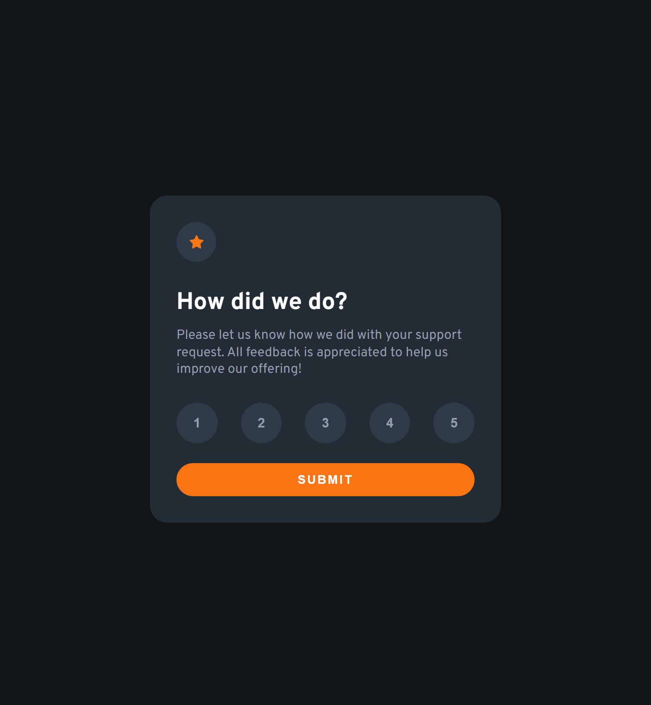

# Frontend Mentor - Interactive rating component solution

This is a solution to the [Interactive rating component challenge on Frontend Mentor](https://www.frontendmentor.io/challenges/interactive-rating-component-koxpeBUmI). Frontend Mentor challenges help you improve your coding skills by building realistic projects. 

## Table of contents

- [Overview](#overview)
  - [The challenge](#the-challenge)
  - [Screenshot](#screenshot)
  - [Links](#links)
- [My process](#my-process)
  - [Built with](#built-with)
  - [What I learned](#what-i-learned)
- [Author](#author)

## Overview

### The challenge

Users should be able to:

- View the optimal layout for the app depending on their device's screen size
- See hover states for all interactive elements on the page
- Select and submit a number rating
- See the "Thank you" card state after submitting a rating

### Screenshot

### Links

- [Solution URL](https://github.com/mostafa-meerzad/rating-component)
- [Live Site URL](https://sensational-souffle-5137b9.netlify.app/)

## My process

### Built with

- Semantic HTML5 markup
- Flexbox
- CSS Grid
- Mobile-first workflow
- [React](https://reactjs.org/) - JS library
- [Framer Motion](https://github.com/mostafa-meerzad/rating-component)

### What I learned
css logical-properties

## Author

- Frontend Mentor - [mostafa-meerzad](https://www.frontendmentor.io/profile/mostafa-meerzad)
- Github - [mostafa-meerzad](https://github.com/mostafa-meerzad)
- Instagram - [mostafa-meerzad](https://www.instagram.com/mostafameerzad/)
- linkedIn - [mostafa-meerzad-a753371b7](https://www.linkedin.com/in/mostafa-meerzad-a753371b7)
